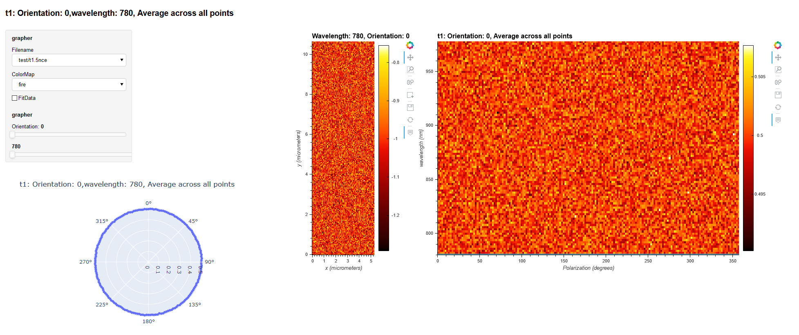

# Dashboard
Visualization, analsyis and aqusition dashboard

Originally the _holoviz_ branch of [2020SummerResearch](https://github.com/UNTNeogiLab/2020SummerResearch)
## Pypi installation 
*coming soon*
## Development installation

### Using Poetry (requires python)
https://python-poetry.org/  
to download another version of python install `curl https://pyenv.run | bash`  
`poetry install` (installs dependencies)  
### debian/ubuntu/not Arch
Debian/Ubuntu Pip or pipenv may be broken  
The best option is to install [pyenv](https://github.com/pyenv/pyenv) with its build dependencies
### Linux data aqusition/PyVcam  
You'll need [PyVcam](https://github.com/Photometrics/PyVCAM) and the accompanying SDK first
### Windows
Data aqusition is unsupported on windows but fully possible  
Substitute thorpy with thorlabs-apt
### MAC
Data aqusition is unsupported on mac and impossible
### Scanimage
there's some placeholder scanimage code for now
### Updating dependencies

`poetry install`

## Running

`poetry run dashboard` (runs visualization script)
or
```shell
poetry shell
dashboard
```
## Development environment
You'll need to run pipenv shell to get into the pipenv virtual environment  
The better option is to use fish and [fish-poetry](https://github.com/ryoppippi/fish-poetry)
## Server Deployment

Currently out of date for pipenv  
Requires environment with all files

### UNT servers

1. `poetry run python combined.py -server` on compute node
1. `ssh -L 5006:cX-X-X:5006 EUID@vis-01.acs.unt.edu` on local
1. open localhost:5006 on local browser

### Generally

1. `poetry run python combined.py -server` on server
1. port forwarding depending on network configuration
1. open address:5006 on local browser

## Examples


## Decapretated Documentation
## File formats
.3nc: Raman data, unsuported  
.5nc: old RASHG data, netCDF4, uses fiveD.py  
.zarr: new RASHG, zarr, uses sixD.py
## Submodule
Using a git submodule to reference files from the https://github.com/UNTNeogiLab/RASHG project
RASHG is developed in parellel with the project    
When cloning use --recurse-submodules or run  
`git submodule init`  
`git submodule update`


### Using setup.py (requires python and anaconda)

`python setup.py` (older script, depends upon mamba/conda, slower, harder to maintain)

### Using bare pip

`pip install -r config/requirements.txt`

### Jupyter Lab:

Jupyter lab is decapretated in favor of python scripts

## Server Deployment

Requires environment with all files

### UNT servers

1. `panel serve combined.py --address 0.0.0.0` on compute node
1. `ssh -L 5006:cX-X-X:5006 EUID@vis-01.acs.unt.edu` on local
1. open localhost:5006 on local browser

### Generally

1. `panel serve parameterized.ipynb --address 0.0.0.0` on server
1. port forwarding depending on network configuration
1. open address:5006 on local browser
## Troubleshooting information
Hangs on creating Virtual environment  
`virtualenv pyenv --read-only-app-data`  
then activate it (`source pyenv/bin/activate`) and run  
`pipenv sync`  
followed by 
`pipenv run` *whatever*
